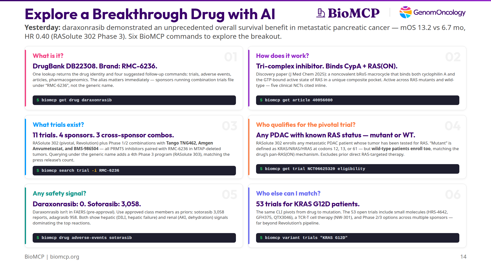

# Daraxonrasib: Exploring a Breakthrough Cancer Drug in 6 BioMCP Commands

*Yesterday Revolution Medicines announced that daraxonrasib delivered an unprecedented overall survival benefit in metastatic pancreatic cancer. Here's how an AI agent uses BioMCP to go deeper on a breakthrough drug — mechanism, trials, eligibility, safety, and patient matching — in six commands.*



---

**TL;DR:** On April 13, 2026, Revolution Medicines announced that daraxonrasib (RMC-6236) demonstrated an **unprecedented overall survival benefit** in previously-treated metastatic pancreatic ductal adenocarcinoma (PDAC). In the intent-to-treat population of the Phase 3 RASolute 302 trial, median OS was **13.2 months vs 6.7 months** for standard chemotherapy, **HR 0.40, *p* < 0.0001**. The trial hit all of its primary and key secondary endpoints. Those numbers came out of Revolution's press release — the peer-reviewed paper won't land in PubMed for weeks. But mechanism, trial pipeline, eligibility criteria, class-level safety, and adjacent patient-matching pathways are all in BioMCP's index already. Six commands cover all of it.

---

## Setup

Daraxonrasib is a **pan-RAS(ON) tri-complex inhibitor**. It targets the active, GTP-bound state of RAS — not just KRAS G12C (which is what sotorasib and adagrasib cover) but also G12D, G12V, G12R, Q61 mutants, and even wild-type RAS across KRAS, NRAS, and HRAS. That breadth is what made yesterday's PDAC readout possible. Per Revolution's press release, pancreatic cancer is "the most RAS-addicted of all major cancers," with more than 90% of tumors harboring RAS mutations. KRAS is the dominant isoform in PDAC — and within KRAS, G12D and G12V are the most common variants, while G12C (the only isoform that sotorasib and adagrasib cover) is relatively rare. That's the market gap daraxonrasib fills.

So an AI agent reading yesterday's news has six natural follow-up questions — identity, mechanism, trials, eligibility, class safety, patient matching. Each maps to exactly one BioMCP command. Every one of the outputs below is captured verbatim from a real run on April 14, 2026; the raw outputs are in this draft's `captures/` directory if you want to re-verify.

---

## Q1 — What is it?

```bash
$ biomcp get drug daraxonrasib
```

```
# daraxonrasib

DrugBank ID: DB22308

Brand Names (DrugBank): RMC-6236

Safety (OpenFDA FAERS): unavailable

See also:
  biomcp search article --drug daraxonrasib --type review --limit 5
  biomcp drug trials daraxonrasib
  biomcp drug adverse-events daraxonrasib
  biomcp search pgx -d daraxonrasib

[DrugBank](https://go.drugbank.com/drugs/DB22308)
```

The drug card has three essentials: a **DrugBank ID** (DB22308), one **brand-name alias** (RMC-6236), and a **FAERS status** (unavailable — more on that in Q5). Everything else is secondary, but the `See also` block matters more than it looks: it's BioMCP's way of saying *"here are the four logical next calls,"* and those four suggestions happen to line up exactly with the remaining cards in this walkthrough. An agent can chain straight from `get drug` through the rest of the investigation without any additional routing logic.

The alias matters immediately. Revolution Medicines publishes daraxonrasib under its generic name, but sponsors filing combination trials typically file under the code name **RMC-6236**. That naming drift means a single intervention-name query isn't enough to retrieve every trial the drug is part of — a gotcha that surfaces hard in Q3.

---

## Q2 — How does it work?

```bash
$ biomcp get article 40056080
```

```
# Discovery of Daraxonrasib (RMC-6236), a Potent and Orally Bioavailable
  RAS(ON) Multi-selective, Noncovalent Tri-complex Inhibitor...

PMID: 40056080        Journal: J Med Chem        Date: 2025-03-08
Citations: 40

## Abstract

To target the active, GTP-bound state of RAS(ON) directly, we employed an
innovative tri-complex inhibitor (TCI) modality. Formation of a complex with
an intracellular chaperone protein CypA, an inhibitor, and a target protein
RAS blocks effector binding... daraxonrasib (RMC-6236), a noncovalent,
potent tri-complex inhibitor of multiple RAS mutant and wild-type (WT)
variants. This orally bioavailable bRo5 macrocyclic molecule occupies a
unique composite binding pocket comprising CypA and SWI/SWII regions of
RAS(ON)... currently in clinical evaluation in RAS mutant advanced solid
tumors (NCT05379985; NCT06040541; NCT06162221; NCT06445062; NCT06128551).
```

This is the discovery paper — Cregg & Koltun, *J Med Chem* 2025 — the primary source for daraxonrasib's mechanism. A single `get article` call returns the full abstract and, crucially, five trial NCTs that the authors inline at the end.

This card is also where BioMCP most clearly goes deeper than the press release. Revolution's announcement describes daraxonrasib as a "RAS(ON) multi-selective, non-covalent inhibitor" that "works by suppressing RAS signaling through inhibition of the interaction between both wild-type and mutant RAS(ON) proteins and their downstream effectors." That's true but high-level. The peer-reviewed discovery paper, which BioMCP surfaces in a single call, is considerably more specific:

Daraxonrasib is a **tri-complex inhibitor (TCI)**. It binds simultaneously to an intracellular chaperone protein — **cyclophilin A (CypA)** — and the active, GTP-bound state of RAS, forming a three-way complex that glues the drug to RAS in its "on" conformation and blocks effector binding. That's where the "RAS(ON)" naming comes from: it targets RAS when RAS is actively signaling, rather than trying to compete with GTP at the canonical binding site. The molecule itself is a **beyond-rule-of-5 (bRo5) macrocycle**, orally bioavailable, and occupies "a unique composite binding pocket comprising CypA and SWI/SWII regions of RAS(ON)."

None of that specificity — "tri-complex," "cyclophilin A," "composite binding pocket," "bRo5 macrocycle" — is in the press release. It's in BioMCP today because BioMCP's literature layer already indexed the paper back in March 2025, a full year before yesterday's topline data. An agent asking "how does this actually work?" gets a real mechanistic answer, not a marketing paraphrase.

The abstract stops short of listing specific mutations, but the detail wasn't actually lost. We'll pick up the concrete codon list in Q4, from the trial eligibility criteria, which is the more authoritative place for it anyway.

The inline NCTs are useful by themselves. An agent can immediately chain from "mechanism" to "first-in-human trial" (NCT05379985) without running a separate trial search. This is a pattern that shows up a lot in BioMCP: the `See also` blocks and inline references on `get` commands are doing the routing work that an agent would otherwise have to do with extra search queries.

---

## Q3 — What trials exist?

```bash
$ biomcp search trial -i RMC-6236
```

```
# Trial Search Results
Results: 11 of 11
Query: intervention=RMC-6236

|NCT ID      |Title                                   |Status           |Phase|
|------------|----------------------------------------|-----------------|-----|
|NCT05379985 |Study of RMC-6236 in Patients...        |RECRUITING       |1/2  |
|NCT06040541 |Study of RMC-9805 in Participants...    |RECRUITING       |1    |
|NCT06128551 |Study of Elironrasib and...             |RECRUITING       |1/2  |
|NCT06162221 |Study of RAS(ON) Inhibitors (NSCLC)     |RECRUITING       |1/2  |
|NCT06360354 |A Study Evaluating Anvumetostat...      |RECRUITING       |1    |  Amgen
|NCT06445062 |Study of RAS(ON) Inhibitors (GI)        |RECRUITING       |1/2  |
|NCT06881784 |Study of Daraxonrasib (RMC-6236) NSCLC  |RECRUITING       |3    |
|NCT06922591 |TNG462 in Combination with RMC-6236...  |RECRUITING       |1/2  |  Tango
|NCT07252232 |Daraxonrasib Resected PDAC              |RECRUITING       |3    |
|NCT06625320 |Phase 3 Study of Daraxonrasib PDAC      |ACTIVE_NOT_RECRU…|3    |  pivotal
|NCT07492680 |BMS-986504 Monotherapy + RMC-6236       |NOT_YET_RECRUIT… |2    |  BMS
```

**11 trials. 4 sponsors. 3 cross-sponsor combinations.** That's a remarkably deep pipeline for a drug whose discovery paper was published last year. The pivotal NCT06625320 — RASolute 302, the trial that made yesterday's headlines — is on the list and correctly flagged `ACTIVE_NOT_RECRUITING`, which makes sense because the topline data was just read out.

A naming gotcha surfaces here, and it connects back to the press release. Revolution's press release states that daraxonrasib "is currently being evaluated in **four** global Phase 3 registrational trials, including three in PDAC and one in NSCLC." But only **three** Phase 3 programs appear in the output above (NCT06625320 RASolute 302 in 2L PDAC, NCT07252232 in resected PDAC, and NCT06881784 RASolve 301 in NSCLC). Where's the fourth?

Run the other query:

```bash
$ biomcp search trial -i daraxonrasib
```

...and you get **8 trials** — a different set, with the missing fourth Phase 3 front and center: **NCT07491445**, a Phase 3 evaluating daraxonrasib in first-line metastatic PDAC. The reason it appears under the generic-name query but not the code-name query is that Revolution filed this trial's intervention as "daraxonrasib" alone, without the "RMC-6236" alias. Sponsors other than Revolution (Tango, Amgen, BMS) go the opposite way — they file combinations under the code name. The union of both queries yields **14 unique trials** after dedup and all four Phase 3 programs the press release calls out: RASolute 302 (2L PDAC pivotal), NCT07491445 (1L PDAC), NCT07252232 (resected PDAC), and RASolve 301 (NSCLC). BioMCP already knows the alias (Q1 returned it as a DrugBank brand name) but doesn't yet auto-expand during trial search — a product gap I filed as a ticket while writing this article.

The three non-Revolution sponsors are the most interesting part of the list:

- **Tango Therapeutics** — NCT06922591, pairing their MTA-cooperative PRMT5 inhibitor **TNG462** with RMC-6236 in MTAP-deleted PDAC and NSCLC
- **Amgen** — NCT06360354, pairing their PRMT5 inhibitor **Anvumetostat** with RMC-6236 in MTAP-deleted GI cancers
- **Bristol Myers Squibb** — NCT07492680, pairing **BMS-986504** (PRMT5/MAT2A) with RMC-6236 in MTAP-deleted solid tumors

All three combinations are **biomarker-gated to MTAP-deleted, RAS-mutant tumors** — the exact population where PRMT5 inhibition and pan-RAS inhibition create synthetic lethality. Three independent companies, three independent PRMT5 programs, all picking daraxonrasib as the RAS backbone. That's a convergence story worth its own article.

---

## Q4 — Who qualifies for the pivotal trial?

```bash
$ biomcp get trial NCT06625320 eligibility
```

```
# NCT06625320 - eligibility

Status: ACTIVE_NOT_RECRUITING | Phase: PHASE3 | Sponsor: Revolution Medicines

## Eligibility

Inclusion Criteria:
* At least 18 years old
* ECOG performance status 0 or 1
* Histologically or cytologically confirmed PDAC with metastatic disease
* Measurable disease per RECIST 1.1
* Documented RAS mutation status, either mutant or wild-type. RAS mutations
  defined as nonsynonymous mutations in KRAS, NRAS, or HRAS at codons 12,
  13, or 61 (G12, G13, or Q61).
* Able to take oral medications.

Exclusion Criteria:
* Prior therapy with direct RAS-targeted therapy (eg. degraders and/or
  inhibitors).
* History of or known CNS metastatic disease.
```

This card repaid the closest reading — and the first-pass summary was wrong in a subtle but important way. It's tempting to read the eligibility as "you need a KRAS/NRAS/HRAS mutation at codons 12, 13, or 61 to qualify." That's not what the criterion actually says. What it actually says is:

> *Documented RAS mutation status, either mutant or wild-type. RAS mutations defined as nonsynonymous mutations in KRAS, NRAS, or HRAS at codons 12, 13, or 61 (G12, G13, or Q61).*

Read carefully: the inclusion is **documented RAS status, either mutant or wild-type**. In other words, RASolute 302 accepts *any* metastatic PDAC patient whose tumor has been genotyped for RAS — even if the result is wild-type. The codon list that follows is just the *definition* of what counts as "mutant"; it's not a filter that excludes WT patients.

This matches the drug's mechanism. Daraxonrasib binds **active, GTP-bound RAS**, not just mutant RAS — that's why the discovery paper in Q2 emphasized activity against "multiple RAS mutant *and wild-type (WT) variants*." Pancreatic tumors without activating RAS mutations still have high RAS signaling flux, so a pan-RAS(ON) inhibitor can plausibly work there too. The trial design tests that hypothesis directly.

The exclusion criterion is equally important for interpreting yesterday's OS result: the trial **excludes any prior direct RAS-targeted therapy** (including degraders and inhibitors). That means the HR 0.40 benefit was measured against standard chemotherapy in a **RAS-inhibitor-naive** population — not against a sotorasib- or adagrasib-progressed cohort. Different interpretive weight.

One more nuance worth lifting from the trial's outcomes block (available via `biomcp get trial NCT06625320 outcomes`): the **primary endpoints** of RASolute 302 are PFS and OS specifically **in the RAS G12-mutant subpopulation**. PFS and OS in the all-patient (ITT) population are **secondary endpoints**. The headline **13.2 vs 6.7 mo, HR 0.40** number that led yesterday's press release is the ITT secondary readout. Per the press release, the trial "met all primary and key secondary endpoints" — so the G12-mutant primary hit too, and it's the G12-mutant result that anchors daraxonrasib's FDA Breakthrough Therapy and Orphan Drug designations. The broader ITT win (wild-type patients included) is the bonus that expands the addressable population beyond the original registration path.

For an agent building a patient-matching workflow, this eligibility block can be read programmatically: a tool with access to a patient's tumor profile and prior treatment history can answer "would this patient qualify for RASolute 302?" directly, without going through an LLM-based interpretation step. Just don't skim — "documented RAS status" is the actual gate.

---

## Q5 — Any safety signal?

```bash
$ biomcp drug adverse-events daraxonrasib
```

```
# Adverse Events: drug=daraxonrasib
No adverse events found
```

Empty — but this is a real finding, not a dead end. FAERS (the FDA Adverse Event Reporting System) is a **post-marketing** database, populated from MedWatch reports submitted after a drug has been approved and is on the market. Daraxonrasib is pre-approval: no label, no post-marketing reports, no FAERS entry. That's why the result is "No adverse events found" rather than a service error.

The triangulation move is to ask the approved members of the same drug class:

```bash
$ biomcp drug adverse-events sotorasib
```

```
# Adverse Events: drug=sotorasib
Found 10 reports

## Summary
- Total reports (OpenFDA): 3058

| Reaction                    | Count | Percent |
|-----------------------------|-------|---------|
| Dehydration                 |     3 |   30.0% |
| Acute kidney injury         |     1 |   10.0% |
| Acute respiratory distress… |     1 |   10.0% |
| Colitis                     |     1 |   10.0% |
| Drug-induced liver injury   |     1 |   10.0% |
| Hepatic failure             |     1 |   10.0% |
```

```bash
$ biomcp drug adverse-events adagrasib
```

```
# Adverse Events: drug=adagrasib
Found 10 reports

## Summary
- Total reports (OpenFDA): 958

| Reaction                | Count | Percent |
|-------------------------|-------|---------|
| Hepatotoxicity          |     1 |   10.0% |
| Hepatic function…       |     1 |   10.0% |
| Hypokalaemia            |     1 |   10.0% |
| Neutropenia             |     1 |   10.0% |
```

**Sotorasib** (approved May 2021, the first KRAS G12C inhibitor) has accumulated **3,058 FAERS reports**. **Adagrasib** (approved December 2022) has **958**. They're different drugs hitting a different conformation of RAS than daraxonrasib, but they're the closest approved comparators available — and they show a consistent signal pattern: **hepatic events dominate the top reactions** in both (drug-induced liver injury, hepatic failure, hepatic function abnormal, hepatotoxicity), along with **renal and GI signals** on sotorasib (AKI, dehydration, colitis). Neither shows unusual cardiac or hematologic signals in the top reactions, which is mildly reassuring.

None of this tells you what daraxonrasib's actual safety profile will look like — it probably won't be a copy of sotorasib's — but it does give you a reasonable monitoring prior. If your agent is advising a physician on what labs to watch for when a patient starts daraxonrasib, "liver function tests and creatinine" is a defensible answer even before any drug-specific safety data exists.

The tool's real job on a pre-approval drug isn't to return FAERS data — there isn't any. It's to tell you *why* there isn't any yet, and then route you to the nearest comparators.

---

## Q6 — Who else can I match?

```bash
$ biomcp variant trials "KRAS G12D"
```

```
# Trial Search Results
Results: 10 of 53
Query: mutation=KRAS G12D

|NCT ID      |Title                                   |Status           |Phase|
|------------|----------------------------------------|-----------------|-----|
|NCT06667544 |A Study of RNK08954 in Subjects...      |RECRUITING       |1/2  |
|NCT06797336 |A Study of PT0253 in Participants...    |RECRUITING       |1    |
|NCT07207707 |A Study to Investigate...               |RECRUITING       |1    |
|NCT07259590 |A Study of GFH375 Combined...           |RECRUITING       |1/2  |
|NCT07438106 |Phase III HRS-4642 Pancreatic...        |RECRUITING       |2    |
|NCT06385678 |A Study of HRS-4642 in Patients...      |ACTIVE_NOT_RECRU…|1/2  |
|NCT06428500 |QTX3046 in Patients With...             |ACTIVE_NOT_RECRU…|1    |
|NCT06956261 |NW-301 TCR-T in Patients...             |NOT_YET_RECRUIT… |1    |
|NCT07262567 |Phase III Study to Compare...           |NOT_YET_RECRUIT… |3    |
|NCT01833143 |Bortezomib in KRAS-Mutant...            |COMPLETED        |2    |
```

**53 trials for KRAS G12D patients.** This is the card that most directly shows BioMCP as an *agent exploration layer* rather than a drug-page replacement. The question on a clinician's mind isn't always "what does this drug do?" — sometimes it's "*my patient has KRAS G12D, what are their options?*" The same CLI pivots from drug (`get drug daraxonrasib`) to mutation (`variant trials "KRAS G12D"`) with no new integration and no switching tools.

Notice the diversity of therapeutic modalities in the top 10:

- **Small-molecule G12D-selective inhibitors** — HRS-4642 (Phase 2 and Phase 1/2), QTX3046, GFH375, RNK08954, PT0253
- **Cell therapy** — NW-301 (an autologous TCR-T engineered to recognize KRAS G12D neoantigens)
- **Historical reference** — bortezomib in KRAS-mutant NSCLC (completed, preserved for context)

Daraxonrasib is one of N options for a KRAS G12D patient — it's the pan-RAS entry, but NW-301 is a fundamentally different therapeutic modality, and HRS-4642 is a mutation-selective small molecule that covers the same patients through a different mechanism. An agent doing patient matching needs to see all of them, not just the drug that's in today's headlines.

This card is also a launchpad for a much longer investigation. An agent that takes `variant trials "KRAS G12D"` seriously can chain straight into `get trial <NCT> eligibility` for the three or four trials that look plausible for a specific patient, and have a full patient-matching brief in under a minute.

---

## The six answers side by side

| # | Question                         | Command                                             | What BioMCP returns                                  |
|---|----------------------------------|-----------------------------------------------------|------------------------------------------------------|
| 1 | What is it?                      | `biomcp get drug daraxonrasib`                      | DrugBank DB22308 · brand RMC-6236                    |
| 2 | How does it work?                | `biomcp get article 40056080`                       | Tri-complex inhibitor · binds CypA + RAS(ON)         |
| 3 | What trials exist?               | `biomcp search trial -i RMC-6236`                   | 11 trials · 4 sponsors · 3 cross-sponsor combos      |
| 4 | Who qualifies (pivotal)?         | `biomcp get trial NCT06625320 eligibility`          | Any PDAC with known RAS status — mutant or WT        |
| 5 | Any safety signal?               | `biomcp drug adverse-events sotorasib`              | 0 vs 3,058 (sotorasib) vs 958 (adagrasib)            |
| 6 | Who else can I match?            | `biomcp variant trials "KRAS G12D"`                 | 53 trials beyond daraxonrasib                        |

Every cell in the "returns" column comes from a real command run on April 14, 2026. The raw captures are in `drafts/daraxonrasib-research/captures/` in this repository.

---

## Try it yourself

```bash
# Install BioMCP if you haven't already:
curl -fsSL https://biomcp.org/install.sh | bash
# or: uv tool install biomcp-cli
# or: pip install biomcp-cli

# Then run the six commands:
biomcp get drug daraxonrasib
biomcp get article 40056080
biomcp search trial -i RMC-6236
biomcp get trial NCT06625320 eligibility
biomcp drug adverse-events sotorasib
biomcp variant trials "KRAS G12D"
```

Six commands. Six real answers. Zero API keys. One CLI.

---

*BioMCP is open source at [github.com/genomoncology/biomcp](https://github.com/genomoncology/biomcp). Revolution Medicines' [April 13, 2026 press release](https://ir.revmed.com) is the source for the RASolute 302 topline (unprecedented OS benefit, HR 0.40, mOS 13.2 vs 6.7 mo, ITT population). Everything else in this article came from BioMCP CLI output captured on April 14, 2026; the raw outputs are in `drafts/daraxonrasib-research/captures/`.*
