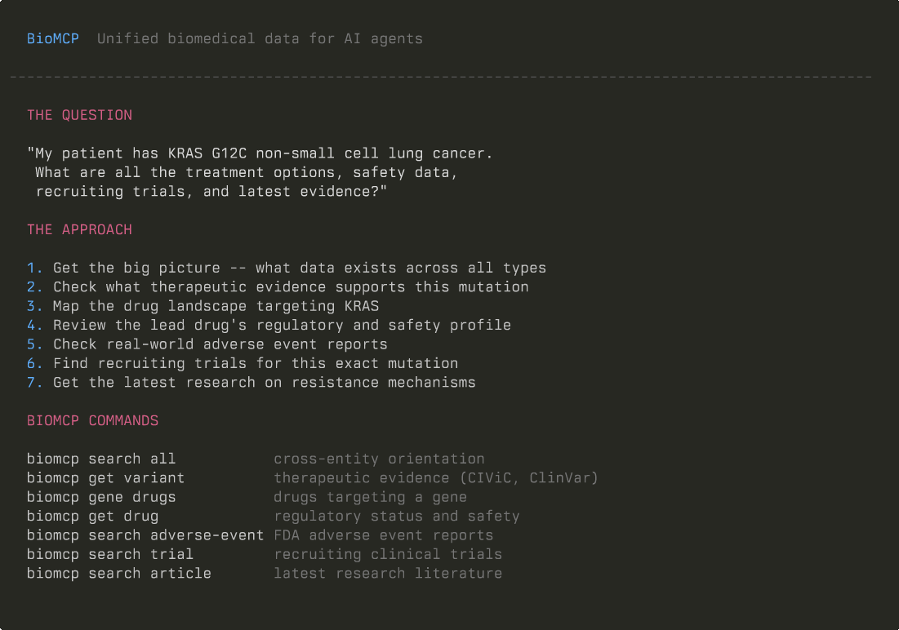

# KRAS G12C Treatment Landscape in 7 Commands

*How an AI agent uses BioMCP to assemble a working treatment picture for a KRAS G12C NSCLC patient — drugs, safety, trials, and resistance — in under two minutes.*

**TL;DR:** A clinician has a patient with KRAS G12C non-small cell lung cancer. An AI agent chains 7 BioMCP commands across 10+ data sources to surface drugs targeting KRAS, review FDA regulatory and safety data, find recruiting trials, and retrieve the latest resistance research. Counts shown below are example outputs from a live run and will change as upstream databases update.



---

## The Problem

Your patient has KRAS G12C-mutated non-small cell lung cancer. You need answers:

- What drugs target this mutation?
- Which are FDA-approved? What's the safety profile?
- What does the post-market adverse event reporting look like?
- What clinical trials are recruiting?
- What does the latest research say about resistance?

Each answer lives in a different database: CIViC for curated variant evidence, Drugs@FDA for regulatory status, OpenFDA FAERS for post-market adverse event reporting, ClinicalTrials.gov for recruiting studies, PubMed for recent publications. Assembling the picture manually means a dozen browser tabs and an afternoon of copy-paste.

An AI agent with access to BioMCP does it in seven calls.

---

## How to Think About It

A clinician building a treatment landscape works through a natural cascade:

1. **Orient.** What data exists? How big is the landscape?
2. **Check variant annotations.** What do knowledgebases say about this specific variant?
3. **Map the drugs.** What targets KRAS in the structured drug-target databases?
4. **Review the lead drug.** Regulatory status, mechanism, approval history.
5. **Check safety reporting.** What does the FDA adverse event reporting system show?
6. **Find trials.** What options exist beyond approved therapies?
7. **Track resistance.** What's the cutting-edge research on why these drugs stop working?

Each step maps to a BioMCP command.

---

## Step 1: Orient Across All Entity Types

Start broad. BioMCP's `search all` gives a counts-first overview across every entity type — genes, variants, drugs, trials, articles, pathways, and more — in a single call.

```bash
$ biomcp search all --gene KRAS --disease "non-small cell lung cancer" --counts-only
```

```
# Search All: gene=KRAS disease=non-small cell lung cancer

## Genes (1)
## Variants (1741)
## Diseases (1)
## Drugs (1)
## Trials (84)
## Articles (42)
## Pathways (0)
## PGx (0)
## GWAS (0)
```

**1,741 known variants** in KRAS. **84 trials** mentioning both KRAS and NSCLC. **42 articles** at the intersection. The landscape is large — the agent now knows to focus on the G12C variant specifically rather than KRAS broadly.

---

## Step 2: Pull Variant Annotations and Evidence Records

Now the agent pulls variant annotations and evidence records from CIViC (Clinical Interpretation of Variants in Cancer) and ClinVar. These are curated knowledgebase entries — some historical, some disease-specific — not a direct therapeutic recommendation.

```bash
$ biomcp get variant "KRAS G12C" civic clinvar
```

```
# KRAS p.G12C - civic, clinvar
## ClinVar
Top disease (ClinVar): Endometrial carcinoma (1 report)
Conditions (8 reports):
- Endometrial carcinoma (1 report)
- Gallbladder cancer (1 report)
- Lung adenocarcinoma (1 report)
- Non-small cell lung carcinoma (NSCLC) (1 report)
- RASopathy (1 report)
...
## CIViC
### Cached Evidence (MyVariant)
| Evidence | Type | Level | Disease | Therapies |
|---|---|---|---|---|
| EID227 | DIAGNOSTIC | B | Lung Cancer | - |
| EID1217 | PROGNOSTIC | B | Lung Non-small Cell Carcinoma | - |
| EID1216 | PREDICTIVE | B | Colorectal Cancer | Gefitinib, Erlotinib |
...
```

CIViC provides diagnostic, prognostic, and predictive evidence records across multiple cancer types. Note that the therapies shown here (gefitinib, erlotinib) are from CIViC's historical evidence in colorectal cancer — not the current G12C-targeted therapy story. The current FDA-approved G12C therapies (sotorasib, adagrasib) appear in the next step. ClinVar shows 8 condition associations spanning NSCLC, lung adenocarcinoma, and other cancer types. The variant is well-characterized across multiple knowledgebases.

---

## Step 3: Map Drugs with Structured Target Annotations

What drugs have KRAS listed as a target in the drug-target interaction databases (DGIdb, OpenTargets)?

```bash
$ biomcp gene drugs KRAS
```

```
# Drugs: target=KRAS

Found 5 drugs

| Name | Mechanism | Target |
|---|---|---|
| garsorasib | small-molecule | KRAS |
| sotorasib | Inhibitor of GTPase KRas | KRAS |
| fulzerasib | small-molecule | KRAS |
| adagrasib | Inhibitor of GTPase KRas | KRAS |
| lonafarnib | Inhibitor of Protein farnesyltransferase | KRAS |
```

Five drugs from the sources queried. **Sotorasib** (Lumakras, Amgen) and **adagrasib** (Krazati, Mirati) are the two U.S.-approved G12C-specific covalent inhibitors. Garsorasib and fulzerasib are investigational. Lonafarnib is a farnesyltransferase inhibitor with a different mechanism.

Note: the broader KRAS G12C pipeline includes additional agents in advanced development (divarasib, olomorasib, glecirasib) that don't appear in this gene-to-drug pivot. Structured target annotations vary across upstream drug-target sources and can lag clinical development. BioMCP can look these agents up individually (`biomcp get drug divarasib`), and the trial search in Step 6 surfaces them through their clinical programs.

The agent picks sotorasib as the lead approved drug for a deeper look.

---

## Step 4: Review the Lead Drug

What's sotorasib's regulatory history, and what safety data can BioMCP pull?

```bash
$ biomcp get drug sotorasib regulatory safety
```

```
# sotorasib - regulatory, safety
## Regulatory (US - Drugs@FDA)

### NDA214665

- Sponsor: AMGEN INC
- Brands: LUMAKRAS
- Generic Names: SOTORASIB
| Submission Type | Number | Status | Date |
|---|---|---|---|
| SUPPL | 9 | AP | 2025-01-16 |
| SUPPL | 12 | AP | 2024-09-30 |
| ORIG | 1 | AP | 2021-05-28 |

## Safety (US - OpenFDA)
...
```

FDA-approved since May 2021 under NDA214665. Multiple supplemental approvals through January 2025 indicate an expanding label. The agent can now check what the real-world safety data looks like.

---

## Step 5: Check Real-World Adverse Events

BioMCP queries the FDA Adverse Event Reporting System (FAERS) directly.

```bash
$ biomcp search adverse-event --drug sotorasib --serious
```

```
# Adverse Events: drug=sotorasib, serious=true
Found 10 reports

## Summary
- Total reports (OpenFDA): 2465
- Returned reports: 10
| Reaction | Count | Percent |
|---|---|---|
| Dehydration | 3 | 30.0% |
| Oedema peripheral | 2 | 20.0% |
| Acute kidney injury | 1 | 10.0% |
| Acute respiratory distress syndrome | 1 | 10.0% |
| Drug-induced liver injury | 1 | 10.0% |
| Hepatic failure | 1 | 10.0% |
...
```

OpenFDA FAERS shows **2,465 serious reports** mentioning sotorasib in this query. FAERS is a spontaneous reporting system — these counts do not establish incidence or causality, and the percentages reflect only the 10 sampled reports, not the full corpus. These reports are hypothesis-generating: useful for surfacing events worth reviewing alongside the prescribing information, which lists diarrhea, musculoskeletal pain, nausea, fatigue, hepatotoxicity, and cough as the most common adverse reactions for single-agent NSCLC use.

---

## Step 6: Find Recruiting Trials

What trials are recruiting for KRAS G12C NSCLC right now?

```bash
$ biomcp search trial -c "NSCLC" --mutation "KRAS G12C" -s recruiting --limit 5
```

```
# Trial Search Results

Results: 5 of 62

Query: condition=NSCLC, status=recruiting, mutation=KRAS G12C

| NCT ID | Title | Status | Phase | Conditions |
|---|---|---|---|---|
| NCT06582771 | A Study of Sotorasib in P... | RECRUITING | 2 | Non Small Lung Cancer |
| NCT07012031 | Sotorasib in Combination... | RECRUITING | 1/2 | Locally Advanced Lung Non-Small Cell Carcinoma... |
| NCT06119581 | A Study of First-Line Olo... | RECRUITING | 3 | Carcinoma, Non-Small-Cell Lung, Neoplasm Metastasis |
| NCT06172478 | A Study of HER3-DXd in Su... | RECRUITING | 2 | Advanced Solid Tumor, Melanoma, Head and Neck... |
| NCT04302025 | A Study of Multiple Thera... | RECRUITING | 2 | Non-small Cell Lung Cancer |
```

**62 recruiting trials** for KRAS G12C NSCLC. The landscape includes sotorasib combinations, new G12C inhibitors, and ADC (antibody-drug conjugate) approaches. A clinician could use `biomcp get trial NCT06582771 eligibility` to check specific patient eligibility.

---

## Step 7: Latest Research on Resistance

Acquired resistance is the clinical challenge driving the trial landscape. What does the latest research say?

```bash
$ biomcp search article -g KRAS --keyword "G12C resistance" --since 2024 --limit 5
```

```
# Articles: gene=KRAS, keyword=G12C resistance

Found 5 articles

| PMID | Title | Source(s) | Date |
|---|---|---|---|
...

Showing 1-5 of N results.
```

The latest publications cover resistance mechanisms (secondary KRAS mutations, bypass pathway activation), combination strategies designed to overcome resistance, and emerging approaches beyond covalent inhibitors.

---

## What Just Happened

An AI agent assembled a working treatment landscape in 7 commands:

| Step | Command | What It Surfaced |
|---|---|---|
| 1 | `biomcp search all` | Orientation: variants, trials, articles across entity types |
| 2 | `biomcp get variant` | CIViC + ClinVar variant annotations and evidence records |
| 3 | `biomcp gene drugs` | 5 drugs with structured KRAS target annotations |
| 4 | `biomcp get drug` | Sotorasib FDA approval history and regulatory status |
| 5 | `biomcp search adverse-event` | FAERS spontaneous reports (hypothesis-generating) |
| 6 | `biomcp search trial` | Recruiting trials for KRAS G12C NSCLC |
| 7 | `biomcp search article` | Latest resistance research |

Seven entity types queried. Ten-plus data sources: CIViC, ClinVar, OpenTargets, DGIdb, Drugs@FDA, OpenFDA FAERS, ClinicalTrials.gov, PubTator3, Europe PMC, and more. Each command took seconds. Not a substitute for clinical judgment — but a fast way to assemble the evidence landscape that informs it.

---

## Try It

```bash
uv tool install biomcp-cli
```

Then start with your own mutation:

```bash
biomcp search all --gene BRAF --disease melanoma --counts-only
```

Documentation: [biomcp.org](https://biomcp.org) | Code: [github.com/genomoncology/biomcp](https://github.com/genomoncology/biomcp)
